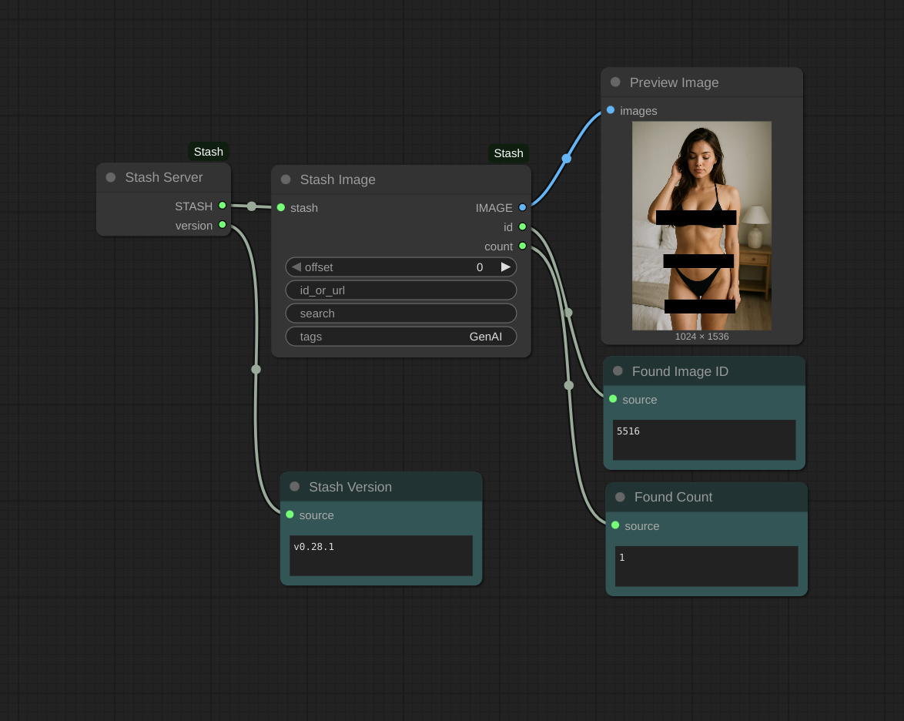

# ComfyUI-Stash

ComfyUI-Stash provides nodes for [ComfyUI][comfyui] to access content within [Stash][stash], the organizer for *gentlemens' special-interest content*.



If you have Stash, these nodes let you easily use Stash content in your Comfy work.


## Installing and Using

### Easy User Install

The best way to use ComfyUI-Stash is via the ComfyUI Manager. Search for "Stash" in its *Custom Nodes Manager*. As usual, install and then restart Comfy to activate the nodes.

### You Must Set Stash Settings

To use Stash, you must configure Comfy with the correct Stash URL and API Key.

In ComfyUI, click the lower-left "gear" to open its settings. On the left, click the **Stash** section which will reveal settings for **Stash API**.

You must copy **API Key** from your Stash security page. For example, if Stash is on your local computer, the security page is at (http://localhost:9999/settings?tab=security)(http://localhost:9999/settings?tab=security). (If not, correct the hostname of that URL.) Paste the entire API key into ComfyUI.

The **API URL** may already be correct if Stash is on your local computer. If not, correct the hostname (and possibly port) but remember to keep the `/graphql` path.

### Developer Install

From your root `ComfyUI` clone, change into its `custom_nodes` directory and clone this repo there:

```bash
git clone https://github.com/zyquon/ComfyUI-Stash
```

## Nodes

These nodes currently exist and work.

### Stash Server

This required node handles connecting to Stash from ComfyUI.

Outputs

* **STASH** - The Stash service, needed by other nodes
* *version* - A string representing the current Stash version, useful for confirming things work

### Stash Image

This node queries Stash for an image which can be used broadly by ComfyUI. It supports several ways to search and query Stash, such as by ID or by filename. *Stash Image* will combine (*"OR"*) all results for all search parameters you provide, and it will output the first matching image by default, or the *nth* matching image by setting `offset`.

Inputs

* **stash** - Required Stash server
* *id_or_url* - Optional search by ID. You can paste the Stash web UI's URL for that image; the node will use the ID from within that URL. So if you see something in Stash that you like, just copy/paste it here. Or, you can just paste an ID here, or even a comma-separated list of IDs.
* *search* - Optional search query, the same as the Stash *Search* bar in its web UI. This is useful for searching by filename or folder name.

Outputs

* **IMAGE** - The image. Animated webp and GIFs will include all frames as an image batch.
* *id* - The ID of the Stash Image used, useful for testing
* *count* - The number of all Stash images matching this query, useful for testing. The `offset` input must always be smaller than this.

## Future

The following additions are planned but not finished yet.

* Using Stash video content
* Storing back into Stash

[stash]: https://github.com/stashapp/stash
[comfyui]: https://github.com/comfyanonymous/ComfyUI